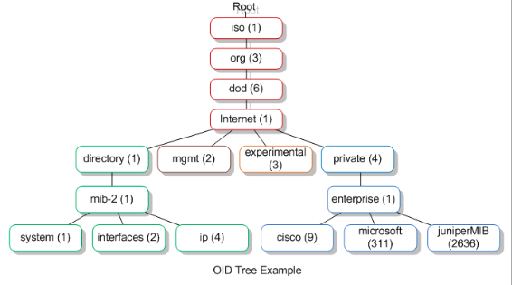

# SNMP 
## (**S**)imple (**N**)etwork (**M**)anagement (**P**)rotocol

## WHAT IS SNMP ?

SNMP (Simple Network Management Protocol) is a protocol used to manage and monitor network devices such as routers, switches, servers, and printers. SNMP is widely used in network management systems to collect and organize information about network performance, connectivity, and health.

SNMP operates by collecting and organizing information from different network devices and presenting it in a standardized format. The information collected by SNMP is stored in a Management Information Base (MIB) and can be accessed by network administrators and management systems using SNMP commands.

SNMP allows network administrators to monitor network devices, detect and diagnose network issues, configure network settings, and enforce security policies. SNMP can be used to perform tasks such as monitoring traffic flow, detecting unauthorized network access, and identifying network bottlenecks.

SNMP is a vendor-neutral protocol, which means that it can be used with devices from different manufacturers. SNMP is also easy to use and configure, making it a popular choice for network management.

### USE CASES
-   Network devices
-   hosts (linux,windows)

### VERSIONS
- v1 ,v2c , v3

### AUTHENTICATION (v3)

-   Athentication : username + password -> get hashed: MD5 or SHA
-   encryption: *privacy passphrase* ,  DES or AES

### SNMP COMMANDS (& CONCEPTS)

**<u>WALK: </u>**

*example:*
```sh
snmpwalk -v3 -l AuthPriv -u "username" -a SHA -A "myPassword" -x AES -X "myPassword" "FQDN.to.network.org or IP"
```

SNMP Walk is a procedure used to collect information about network devices that are monitored by Simple Network Management Protocol (SNMP). It is a part of the SNMP Management Information Base (MIB) browser that allows an administrator to traverse the entire MIB tree of a device and retrieve information from each node.

To perform an SNMP walk, an SNMP client sends a series of requests to the SNMP agent on the target device, starting at the root of the MIB tree and moving through each subtree. The agent responds with the current value of each MIB object it manages, including system statistics, interface status, and other important network parameters.

SNMP Walk is useful for network administrators because it offers a quick and easy way to identify problems on a network, gather data on device performance, and troubleshoot network issues. It is often used in conjunction with other SNMP tools, such as SNMP Get and SNMP Set, to fully manage network devices.

**<u>GET: </u>**

*example:*
```sh
snmpget -On "FQDN.to.network.org or IP" "OID"
```


SNMP Get is a command used in Simple Network Management Protocol (SNMP) to retrieve the value of a particular variable or object from a network device. It is a request sent by the SNMP manager to the SNMP agent, which operates on a network device such as a router, switch, or server. 

The SNMP agent then responds to the request, returning the requested value or an error message if the value cannot be retrieved. The SNMP Get request is a fundamental operation that enables network administrators to monitor and manage their network devices remotely.

**<u>SET: </u>**

SNMP SET enables network administrators to manage network devices remotely without having to physically access and configure each device individually. With SET, network administrators can change configuration settings such as IP addresses, routing tables, passwords, and more, from a single point of management.

To use SNMP SET, network administrators must have the proper SNMP community string or authentication information for the device they wish to manage. They then use a network management system (NMS) or software application to send an SNMP SET command to the device. The device will then respond with a confirmation message indicating that the variable has been successfully updated.

Overall, SNMP SET provides an efficient and flexible way to manage and monitor network devices, helping to ensure network performance and security.

**<u>TRAP: </u>**

SNMP trap is a message sent by an SNMP agent to an SNMP manager in order to notify it of an event or a problem that has occurred in the managed device. Traps are initiated by the managed device and are sent to the SNMP manager without any request from the manager. Traps can be classified into two types: generic traps and specific traps. Generic traps are predefined and standardized traps that are used to convey specific classes of events, such as link up/down or authentication failure. Specific traps are custom traps that are vendor-specific and are used to convey events specific to a particular device or application. SNMP traps are an important feature of network management that allows administrators to quickly and efficiently respond to network problems and maintain network performance.

### SNMP CONCEPTS

**<u>OID: </u>**

SNMP OID (Object Identifier) is a unique identifier that is used to identify network elements and their associated properties in the Simple Network Management Protocol (SNMP) management information base (MIB). OIDs are organized in a hierarchical structure, with each level representing a different aspect of the object being identified. The higher-level OIDs represent more generalized and broader categories of objects, while the lower-level OIDs represent more specific and detailed properties of the objects.

SNMP OIDs are represented in dotted-decimal notation, with each dot separated value representing a different level of the OID hierarchy. For example, the OID for the sysDescr object in the MIB-2 standard is 1.3.6.1.2.1.1.1, where the first three values (1.3.6) represent the Internet, followed by the MIB-2 branch (1.2.1), and then the sysDescr object (1).

SNMP OIDs play a critical role in network management and monitoring, as they enable administrators to collect and analyze information about network devices and applications. With the help of SNMP OIDs, network administrators can monitor network performance, troubleshoot issues, and quickly identify and resolve problems.

**<u>MIB: </u>**



SNMP MIB (Management Information Base) is a file that contains lists of objects, also known as variables or parameters, that are used for managing and monitoring network devices. The SNMP protocol uses MIBs to collect and store data from devices such as routers, switches, servers, printers, etc.

MIB is a hierarchical tree-like structure, where each level is represented by an object identifier (OID). OIDs are unique numeric codes that identify individual objects. The MIB structure can include various information such as system statistics, performance metrics, operational statuses, and other relevant data.

The SNMP protocol uses MIBs to transfer information from network devices to SNMP managers or monitoring systems. SNMP managers can use MIBs to monitor and manage network devices, diagnose and troubleshoot network issues, and gather performance metrics.

MIBs can be device-specific or vendor-specific, and they are standardized by the Internet Engineering Task Force (IETF) and the International Organization for Standardization (ISO). MIBs are typically provided by network device vendors and can be downloaded from their websites or through the SNMP management tools.

